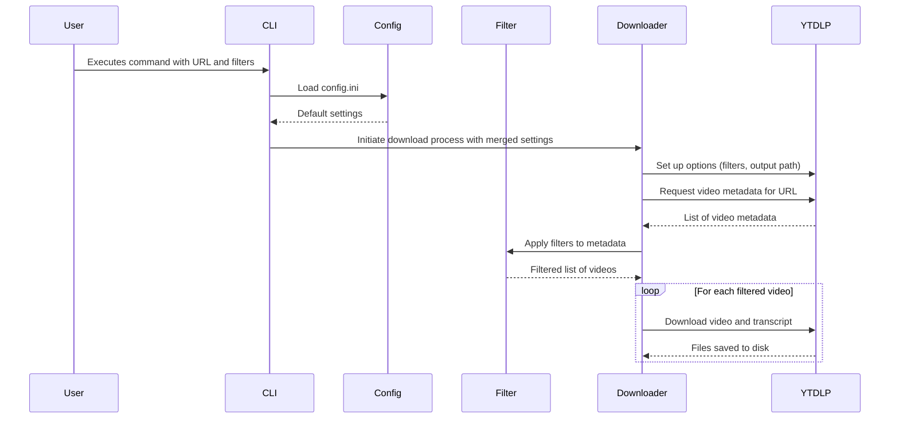

# TikTok Downloader — Architecture & Implementation Spec

This document describes a lean, single-process architecture and detailed design for a command-line tool to download TikTok videos and their metadata based on user-defined filters.

## 1) System architecture overview

### 1.1 Components and boundaries

- **Single CLI Application:** A Python script provides the user interface and orchestrates the entire process.
- **Core Services:**
  - **Filter & Policy Engine:** Applies user-defined filters (likes, views, etc.).
  - **Downloader Service:** Interfaces with the `yt-dlp` library.
  - **Configuration Manager:** Loads settings from a `config.ini` file.
- **External Dependencies:**
  - **TikTok:** The source of all data.
  - **yt-dlp:** The library used for all interactions with TikTok.

Mermaid component diagram:
```mermaid
graph TB
    subgraph External
        TikTok
        YTDLP[yt-dlp library]
    end

    subgraph App[CLI Application]
        CLI[Command-Line Interface (click)]

        subgraph Core Services
            Filter[Filter & Policy Engine]
            Downloader[Downloader Service]
            Config[Configuration Manager]
        end
    end

    CLI --> Config
    CLI --> Filter
    CLI --> Downloader

    Downloader --> YTDLP
    YTDLP --- TikTok
```

### 1.2 Principles

- **Simplicity:** A single script with minimal moving parts.
- **User-centric:** A clear CLI with sensible defaults and powerful filtering options.
- **Maintainability:** A modular design that separates concerns.

## 2) Core Workflows

### 2.1 Video Fetching and Downloading



## 3) CLI & API

### 3.1 CLI Stack

- **click:** For a clean, composable command-line interface.

### 3.2 CLI Commands

The script is controlled via the `tiktok-downloader` command.

**Usage:**
```
Usage: tiktok-downloader [OPTIONS] [TIKTOK_URL]
```

**Arguments:**
- `TIKTOK_URL`: The URL of the TikTok user, hashtag, or video. Optional if `--from-file` is used.

**Options:**
- `--from-file FILE`: Path to a text file containing one TikTok URL per line.
- `--output-path DIRECTORY`: Specify the download directory.
- `--min-likes INTEGER`: Filter videos with at least this many likes.
- `--min-views INTEGER`: Filter videos with at least this many views.
- `--transcripts / --no-transcripts`: Enable or disable transcript downloads.
- `--metadata-only`: Fetch and display metadata without downloading videos.

## 4) Configuration

The script can be configured via a `config.ini` file in the project's root directory.

**Example `config.ini`:**
```ini
[defaults]
output_path = ~/TikTok_Downloads
min_likes = 10000
min_views = 100000
transcripts = true
```

## 5) Deployment

### 5.1 Prerequisites

- Python 3.7+
- `pip`

### 5.2 Installation

1.  **Clone the repository:**
    ```bash
    git clone https://github.com/your-username/tiktok-downloader.git
    cd tiktok-downloader
    ```
2.  **Install:**
    ```bash
    pip install -e .
    ```
3.  **Verify:**
    ```bash
    tiktok-downloader --version
    ```
